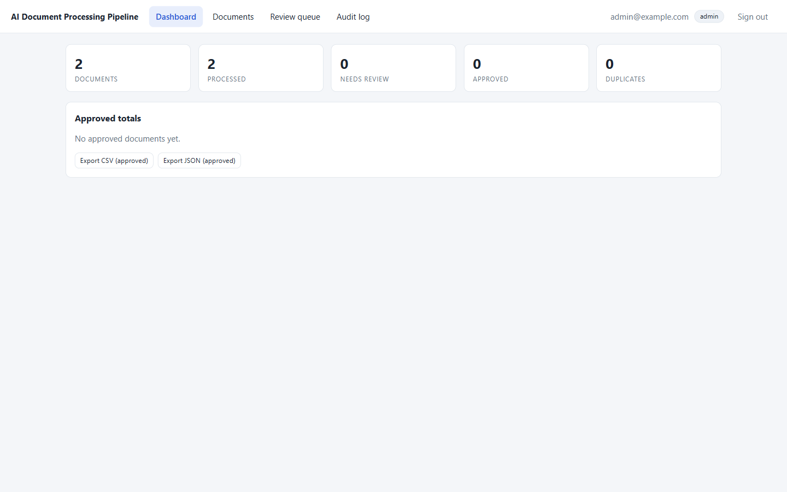
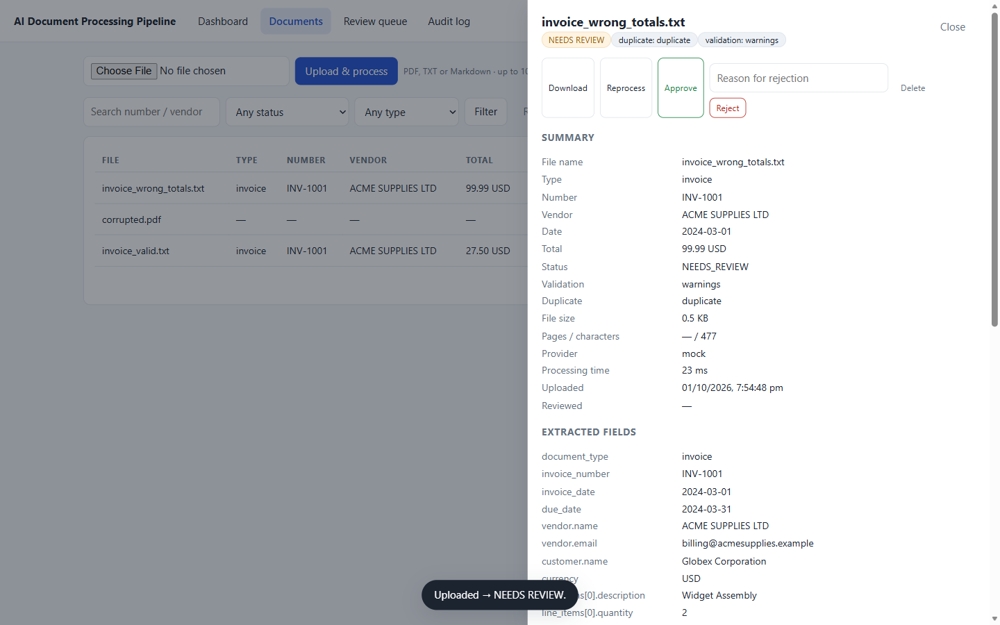
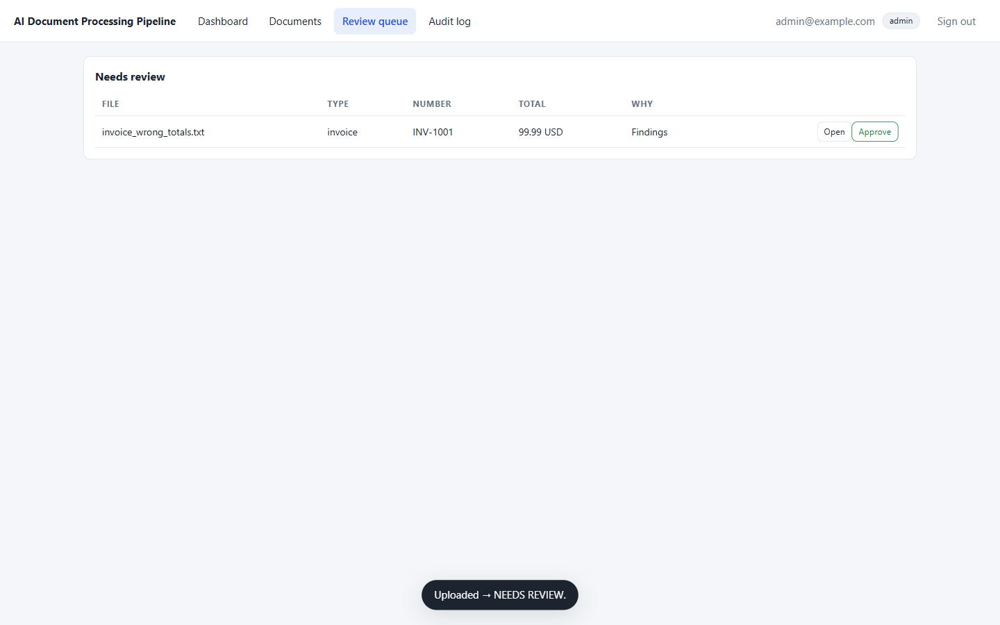
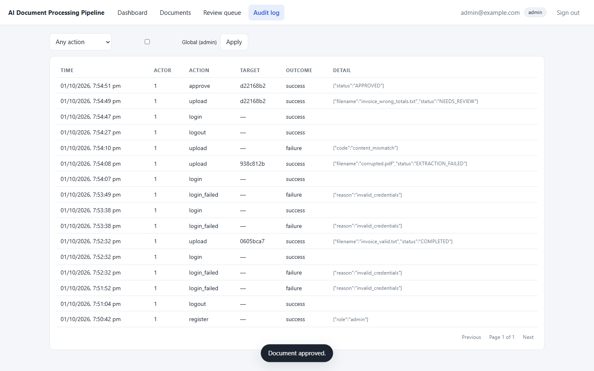

# AI Document Processing Pipeline

Upload invoices, receipts and purchase orders (PDF / TXT / Markdown) and get
structured, validated, duplicate-checked data out — with a human review queue,
an append-only audit log and a safe CSV/JSON export.

The pipeline is deliberately boring and fully deterministic by default: one mock
AI provider (zero cost, no API key), SQLite for storage, and a plain HTML/JS
front end with no build step. Swapping in a real OpenAI-compatible model is a
one-line environment change.

```
upload ─► validate bytes ─► extract text ─► preprocess ─► classify
      ─► AI extraction ─► schema validation ─► business rules
      ─► evidence check ─► duplicate detection ─► status
      ─► human review queue ─► approve / reject ─► export
```

---

## Contents

- [Why this project](#why-this-project)
- [Quickstart](#quickstart)
- [Architecture](#architecture)
- [Pipeline stages](#pipeline-stages)
- [API reference](#api-reference)
- [Security model](#security-model)
- [Testing](#testing)
- [Configuration](#configuration)
- [Design decisions](#design-decisions)
- [Known limitations](#known-limitations)
- [Project layout](#project-layout)

---

## Why this project

Most "AI document extraction" demos stop at *calling a model and printing JSON*.
This one covers the parts that actually break in production:

| Real-world problem | How this project handles it |
| --- | --- |
| The model invents a total that is not in the document | **Evidence check** - every extracted value is searched for in the source text; unsupported values become findings and force human review |
| The model returns prose, extra keys or `null` in the wrong shape | **Strict Pydantic schemas** (`extra="forbid"`, money as `Decimal`, blanks become `None`), one validation-guided retry, then `EXTRACTION_FAILED` |
| `invoice.pdf.exe`, zip bombs, megabyte-long uploads | **Byte-level validation** - extension allowlist, magic-byte sniffing, declared-MIME check, hard size cap, server-generated storage names |
| The same invoice gets paid twice | **Duplicate detection** - file hash, document number, vendor + date + amount signals, with an explainable `duplicate_signals` payload |
| Totals that don't add up | **Business rules** - line items vs subtotal, subtotal + tax vs total, currency consistency, date ordering, each with `error`/`warning` severity |
| Somebody uploads a document containing "ignore your instructions" | Prompt-injection text is just data: it must survive the schema, and it never reaches the database as a field name |
| Nobody knows who changed what | **Append-only audit log** with actor, action, target, correlation id and outcome - names of changed fields, never their values, never secrets |
| Passwords and PII leaking into logs | **Redaction filter** on the logger + safe error envelopes that carry a correlation id instead of internals |
| Junior reviewers making mistakes | **Corrections with history** - old value kept, checks re-run automatically, every change audited |

---

## Quickstart

Requirements: Python 3.11+ (developed on 3.14), no external services.

```powershell
# 1. install
.\.venv\Scripts\python.exe -m pip install -r requirements.txt
copy .env.example .env            # optional: every value has a safe default

# 2. run the API (http://localhost:8000, docs at /docs)
.\.venv\Scripts\python.exe -m uvicorn app.main:app --app-dir backend --port 8000

# 3. run the front end (http://localhost:3000) in a second terminal
.\.venv\Scripts\python.exe scripts\serve_frontend.py --port 3000
```

Open <http://localhost:3000>, click **Create account** and register. To use the
administrator features (global audit view, `scope=all`) create that account
first:

```powershell
$env:ADMIN_EMAIL = "you@example.com"
.\.venv\Scripts\python.exe scripts\seed_admin.py     # prompts for the password
```

The admin role is granted **only** to `ADMIN_EMAIL` - there is no "first user
wins" rule, so a fresh deployment cannot be taken over by whoever registers
first.

Then upload `documents/samples/invoice_valid.txt` and watch it move through the
pipeline, or try the interesting cases:

| Sample | Expected outcome | Why |
| --- | --- | --- |
| `invoice_valid.txt` / `.pdf` / `.md` | `COMPLETED` | clean extraction, all checks pass |
| the same file twice | `DUPLICATE` | identical bytes and matching metadata |
| `invoice_wrong_totals.txt` | `NEEDS_REVIEW` | business rule: total ≠ subtotal + tax |
| `injection_invoice.txt` | `COMPLETED` | injected instructions are treated as plain text |
| `scanned_no_text.pdf`, `corrupted.pdf`, `encrypted.pdf` | `EXTRACTION_FAILED` | no text layer / broken file / encrypted |
| `pdf_masquerading_as_txt.txt` | `415` on upload | content sniffing beats the extension |

Linux/macOS: use `python3 -m pip`, `cp`, and `.venv/bin/python`.

---

## Screenshots

| Dashboard | Document result | Review queue | Audit log |
| --- | --- | --- | --- |
|  |  |  |  |

The document panel shows everything the pipeline produced: the status badges
(`NEEDS REVIEW`, duplicate, validation), the extracted fields, the findings that
caused the review, the corrections history, the stage-by-stage processing run
and the extracted source text - all next to the approve/reject actions.

---

## Architecture

```
                    ┌──────────────────────────────────────────────┐
  browser ─────────►│ frontend/  (plain HTML/CSS/JS, no build)    │
                    │  · every API value rendered with textContent │
                    │  · token in sessionStorage, Bearer header   │
                    └───────────────────┬──────────────────────────┘
                                        │ JSON over HTTP (CORS allowlist)
                    ┌───────────────────▼──────────────────────────┐
                    │ FastAPI  app/main.py                        │
                    │  request-id + logging + security headers    │
                    │  CORS → rate limit → size cap               │
                    │  routers: auth · documents · review ·        │
                    │           reports · health                   │
                    └───────┬───────────────────────┬─────────────┘
                            │                       │
             ┌──────────────▼───────────┐  ┌────────▼───────────────┐
             │ services/                │  │ repositories/          │
             │  pipeline (stages 1-9)   │  │  owner scoping in SQL   │
             │  uploads · storage       │  │  document · audit · user│
             │  review (corrections)    │  └────────┬───────────────┘
             └───────┬──────────────────┘           │
                     │                              │
       ┌─────────────▼──────────────┐   ┌───────────▼────────────┐
       │ documents/  ai/            │   │ SQLite (FK enforced)   │
       │  validation extraction     │   │ documents, users,      │
       │  preprocess classifier      │   │ audit_log, runs, …     │
       │  evidence  business  dupes │   └────────────────────────┘
       │  ai/ provider + mock + oai  │
       └────────────────────────────┘
```

Dependency direction is one-way: `api → services → documents/ai/validation →
schemas/repositories → db/models`. No module reaches back up, which is what keeps
the pipeline testable without HTTP.

### Module map (backend)

| Module | Responsibility |
| --- | --- |
| `app/main.py` | app factory, middleware stack, exception handlers, lifespan |
| `app/api/deps.py` | DB session, bearer auth, rate-limit dependencies |
| `app/api/errors.py` | one error envelope shape for every failure |
| `app/api/serializers.py` | response shapes (documents, findings, runs, audit) |
| `app/api/routers/*` | auth, documents, review, reports, health |
| `app/services/pipeline.py` | the nine stages, status decision, re-validation |
| `app/services/uploads.py` | validate → quota → stream → sniff → record |
| `app/services/storage.py` | UUID file names, containment checks, size caps |
| `app/services/review.py` | corrections (with history), approve/reject |
| `app/documents/*` | validation, extraction, preprocessing, classification, evidence |
| `app/ai/*` | `extract(text, document_type) -> dict` + mock/OpenAI-compatible providers |
| `app/validation/business.py` | arithmetic and consistency rules |
| `app/duplicate_detection/detector.py` | hash + fuzzy signals, explainable output |
| `app/repositories/*` | SQLAlchemy queries with owner scoping built in |
| `app/auth/*` | argon2id hashing, JWT, rate limiting, lockout |
| `app/utils/logging_setup.py` | log redaction and request correlation ids |

---

## Pipeline stages

| # | Stage | Module | Failure result |
| --- | --- | --- | --- |
| 1 | Upload validation (name, extension, MIME, magic bytes, size, quota) | `documents/validation.py`, `services/uploads.py` | rejected before anything is stored (4xx) |
| 2 | Text extraction (PDF/TXT/MD, page and character caps, timeout) | `documents/extraction.py` | `EXTRACTION_FAILED` |
| 3 | Preprocessing (whitespace, de-hyphenation, truncation) | `documents/preprocessing.py` | `EXTRACTION_FAILED` |
| 4 | Classification (invoice / receipt / purchase_order) | `documents/classifier.py` | falls back to `invoice` + warning |
| 5 | AI extraction (one call, at most **one** validation-guided retry) | `ai/*` | `EXTRACTION_FAILED` |
| 6 | Schema validation (strict Pydantic) | `schemas/document_types.py` | recorded as a finding |
| 7 | Business validation (totals, dates, currency) | `validation/business.py` | `VALIDATION_FAILED` (errors) |
| 8 | Evidence check (value present in source text?) | `documents/evidence.py` | `NEEDS_REVIEW` |
| 9 | Duplicate detection (hash + fuzzy signals) | `duplicate_detection/detector.py` | `NEEDS_REVIEW` / `DUPLICATE` |

### Status decision (the priority order matters)

```
business errors            → VALIDATION_FAILED
warnings | unsupported     → NEEDS_REVIEW     (checked first, so review work
possible duplicate           is never hidden behind DUPLICATE)
exact duplicate            → DUPLICATE
otherwise                  → COMPLETED
```

Every run stores its stages in `processing_runs`, so the UI can show exactly
where a document stopped and why.

---

## API reference

Base URL `http://localhost:8000/api/v1` (interactive docs at `/docs`).

| Method | Path | Auth | Purpose |
| --- | --- | --- | --- |
| POST | `/auth/register` | – | create an ordinary account (**always** `role=user`; the administrator is created only by `scripts/seed_admin.py`) |
| POST | `/auth/login` | – | issue a JWT access token |
| GET | `/auth/me` | ✓ | the caller's own account |
| POST | `/auth/logout` | ✓ | record the sign-out (tokens stay stateless) |
| POST | `/documents/upload` | ✓ | multipart upload → full pipeline → stages |
| GET | `/documents` | ✓ | list with `status`, `document_type`, `search`, pagination, `scope=all` (admin) |
| GET | `/documents/{id}` | ✓ | detail: fields, findings, runs, corrections (`include_raw=true` for raw AI output) |
| GET | `/documents/{id}/text` | ✓ | extracted source text (audited) |
| GET | `/documents/{id}/download` | ✓ | the original bytes (audited) |
| POST | `/documents/{id}/reprocess` | ✓ | re-run the pipeline, new run recorded |
| PATCH | `/documents/{id}/corrections` | ✓ | correct one field; checks re-run immediately |
| POST | `/documents/{id}/approve` | ✓ | approve (optional note) |
| POST | `/documents/{id}/reject` | ✓ | reject with a required reason |
| DELETE | `/documents/{id}` | ✓ | delete the record and the stored file |
| GET | `/review/queue` | ✓ | everything waiting for a human |
| GET | `/review/summary` | ✓ | queue counts |
| GET | `/stats` | ✓ | dashboard aggregates, approved totals, quotas |
| GET | `/audit` | ✓ | audit trail with `action` filter, `scope=all` for admins |
| GET | `/export` | ✓ | **approved** documents as `csv` or `json` |
| GET | `/meta` | – | document types, statuses and limits |
| GET | `/health` | – | liveness + database check (rate-limit exempt) |

Example — upload returns the stages so a client can show progress without
polling:

```jsonc
// POST /api/v1/documents/upload   (multipart/form-data, field "file")
{
  "document": { "id": "…", "status": "NEEDS_REVIEW", "total_amount": "11.00", … },
  "stages":   [ { "name": "text_extraction", "status": "ok", "detail": "ok" }, … ],
  "errors":   [],
  "status":   "NEEDS_REVIEW"
}
```

Every error - framework, validation or ours - uses one envelope, and never
contains internals:

```jsonc
{
  "error": {
    "code": "not_found",
    "message": "Document not found.",
    "status": 404,
    "request_id": "1a2b3c4d5e6f7a8b"
  }
}
```

The same `request_id` appears in the `X-Request-ID` response header and in the
server log line for that request.

---

## Security model

| Threat | Control | Where |
| --- | --- | --- |
| Malicious filename / path traversal | name must be a plain file name (no `/`, `\`, `..`, NUL, control chars, leading dot); storage uses a server-generated UUID | `documents/validation.py`, `services/storage.py` |
| Executable or archive upload | extension allowlist (`.pdf/.txt/.md`) plus a `DANGEROUS_EXTENSIONS` blocklist | `documents/validation.py` |
| Content/extension mismatch | magic-byte sniffing of the real bytes + declared-MIME check | `documents/validation.py` |
| Resource exhaustion | streaming size cap (aborts mid-write), per-user document/storage quota, global rate limits, PDF page and character caps | `services/uploads.py`, `storage.py`, `middleware` |
| IDOR (reading someone else's document) | owner filter is part of the SQL; a miss returns **404**, never 403, so existence is not confirmed | `repositories/document_repo.py` |
| Privilege escalation | `POST /auth/register` **always** creates `role=user` - a client can never influence a role, even by registering `ADMIN_EMAIL`. The admin account is created only out of band by `scripts/seed_admin.py` (server-side, password entered at a prompt), and the role is re-read from the database on every request | `api/routers/auth.py`, `services/admin.py`, `api/deps.py` |
| Token forgery | pinned HS256 algorithm (`alg=none` and RS/HS confusion rejected), required `exp`/`iat`/`sub`, short expiry, role not embedded | `auth/tokens.py` |
| Credential stuffing | per-account **and** per-IP lockout after N failures + login rate limit + constant-time dummy verification for unknown emails | `auth/ratelimit.py`, `api/routers/auth.py` |
| Secrets in logs or responses | logger redaction filter; audit detail whitelist; safe error envelopes; `password`/`token` keys are refused by the audit writer | `utils/logging_setup.py`, `repositories/audit_repo.py`, `api/errors.py` |
| SQL injection | parameterized SQLAlchemy queries everywhere; search terms are bound parameters, never string-formatted | `repositories/*.py` |
| XSS via document content | the API returns text; the front end only ever uses `textContent`, never `innerHTML`, plus a strict CSP with no `unsafe-inline` | `frontend/app.js`, `scripts/serve_frontend.py` |
| CSV formula injection | cells starting with `= + - @ tab CR` are prefixed with `'` before export (numbers are left alone) | `api/routers/reports.py` |
| Clickjacking / sniffing / referrer leakage | `X-Frame-Options`, `frame-ancestors 'none'`, `nosniff`, `no-referrer`, `EXPOSE_DOCS=false` outside dev | `main.py`, `config.py` |
| Prompt injection inside a document | provider output is untrusted: strict schema (`extra="forbid"`), string caps, line-item caps, evidence check against the source text | `schemas/`, `ai/`, `documents/evidence.py` |

Defense in depth, not one magic control: even if the model is fooled, the value
either fails the schema, fails the business rules, or fails the evidence check
and lands in the human review queue with the source text next to it.

---

## Testing

```powershell
.\.venv\Scripts\python.exe -m pytest backend\tests -q     # 137 tests (~45s)
.\.venv\Scripts\python.exe scripts\check_api.py           # end-to-end HTTP smoke test
.\.venv\Scripts\python.exe scripts\check_pipeline.py      # pipeline over the sample corpus
.\.venv\Scripts\python.exe scripts\check_eval.py          # accuracy + EVALUATION_REPORT.md
.\.venv\Scripts\python.exe scripts\check_frontend.py      # front-end headers, assets, traversal
.\.venv\Scripts\python.exe scripts\secret_scan.py         # no secrets in the tree
.\.venv\Scripts\python.exe -m bandit -r backend\app        # static security analysis
.\.venv\Scripts\python.exe -m pip_audit                    # dependency vulnerabilities
.\.venv\Scripts\python.exe scripts\make_samples.py        # regenerate the tidy corpus
.\.venv\Scripts\python.exe scripts\eval_hard_cases.py     # regenerate the hard corpus
```

Current numbers with the bundled mock provider: **137 pytest tests pass**, the
pipeline handles **11/11** sample cases, the HTTP smoke test passes ~52 checks
and the front-end server passes 12 checks. `bandit -r backend/app` reports **0
findings**, `pip-audit` reports **no known vulnerabilities** and
`scripts/secret_scan.py` finds **no secrets** anywhere in the tree.

Extraction accuracy, reported honestly:

| Corpus | What it measures | Result |
| --- | --- | --- |
| Tuned (`eval*`, `hard*`) | regression protection for the code that was built against it | 25/25 documents, 109/109 fields (100%) |
| **Held-out (`holdout*`)** | documents written *after* the code was finished, scored once with **no further tuning** | **1/4 documents, 13/17 fields (76.5%)** |
| Overall | the gate enforced by pytest | 26/29 documents, 122/126 fields (96.8%) |

> The bundled mock provider was **tuned while building the main corpus**, so a
> 100% score there proves the tests still protect that behaviour - it is *not* a
> real-world accuracy claim. The held-out row is the honest one: four documents
> written last, scored once, with the three failures left in place and documented
> in [EVALUATION_REPORT.md](EVALUATION_REPORT.md) (dot-leader labels, a
> `Total (tax incl.)` label and a `Tax (7%):` label are not read by the parser;
> the affected fields come back empty and the document goes to human review
> instead of being guessed).

| Area | What is covered |
| --- | --- |
| Unit (no HTTP) | status priority, transition table, extension + MIME + magic-byte sniffing (including the bare-extension regression), password policy, argon2 hashing, rate-limit window, lockout, business rules, evidence check, label/date/amount parsing |
| API integration | register/login/me/logout, uploading every sample type, duplicate detection, review queue, corrections, approve/reject, stats/audit/export, pagination and filters |
| Security | IDOR on all six document endpoints, `scope=all` requires admin, path traversal in ids and filenames, SQL-shaped search, oversized upload, dangerous extension, content/extension mismatch, tampered + `alg=none` + wrong-key tokens, 401 on every private route, error bodies without internals, passwords absent from the audit trail, CORS allowlist (incl. preflight), security headers on error responses, CSV formula injection, XSS payloads as inert data, mass assignment |
| Accuracy gate | the whole evaluation corpus re-run in-process; the tuned corpus must stay at 100%, overall thresholds are 95% field accuracy / 85% document pass rate, and the held-out score is printed |
| Front end | CSP/nosniff/framing headers, asset delivery, SPA fallback, traversal outside `frontend/` |
| Browser (Playwright) | register → upload → drawer → approve → audit, login error handling, and "document content is never executed" |

Every test gets a brand-new database, upload directory and rate-limit state
(`conftest.build_client`), so tests are order-independent and can run in any
combination or individually.

`backend/tests/test_frontend_ui.py` drives the real stack in a browser (register →
upload → drawer → approve → audit, plus "document content is never executed"). It
skips itself when Playwright or the ports are unavailable:

```powershell
.\.venv\Scripts\python.exe -m pip install playwright
.\.venv\Scripts\python.exe -m playwright install chromium
.\.venv\Scripts\python.exe -m pytest backend\tests\test_frontend_ui.py -q
```

---

## Configuration

Everything is environment-driven (see `.env.example`); nothing is hard-coded.

| Variable | Default | Notes |
| --- | --- | --- |
| `APP_ENV` | `dev` | non-dev enforces a real secret, `DEBUG=false`, docs off |
| `SECRET_KEY` | `change-me` | **must** be ≥32 random chars outside dev or startup fails |
| `ADMIN_EMAIL` | – | the address `scripts/seed_admin.py` creates or promotes to admin; registration never grants admin |
| `DATABASE_URL` | `sqlite:///./app.db` | any SQLAlchemy URL |
| `UPLOAD_DIR` | `./uploads` | outside any web root; never served statically |
| `MAX_UPLOAD_MB` | `10` | hard cap, enforced while streaming |
| `MAX_PDF_PAGES` / `MAX_TEXT_CHARS` | `50` / `100000` | extraction limits |
| `AI_PROVIDER` | `mock` | `mock` or `openai_compatible` |
| `OPENAI_COMPATIBLE_BASE_URL` / `_API_KEY` / `_MODEL` | – | works with Ollama, LM Studio, vLLM, OpenAI… |
| `BUSINESS_TOTAL_TOLERANCE` | `0.01` | money comparison tolerance |
| `CORS_ORIGINS` | `http://localhost:3000,http://127.0.0.1:3000` | explicit allowlist, no `*` |
| `RATE_LIMIT_*` | `60/5/10/10/5` per minute | `<count>/<second\|minute\|hour>` |
| `LOGIN_MAX_FAILED` / `LOGIN_LOCKOUT_SECONDS` | `5` / `300` | lockout threshold |
| `EXPORT_MAX_ROWS` | `5000` | export is bounded |
| `EXPOSE_DOCS` | `true` | forced off outside dev |

Use a real model locally (no API key, nothing leaves the machine):

```powershell
$env:AI_PROVIDER = "openai_compatible"
$env:OPENAI_COMPATIBLE_BASE_URL = "http://localhost:11434/v1"   # Ollama / LM Studio / vLLM
$env:OPENAI_COMPATIBLE_API_KEY = "not-needed-locally"
$env:OPENAI_COMPATIBLE_MODEL = "llama3.1"
```

The provider interface is one function, so a custom model is a ~30-line class:

```python
class MyProvider(AIProvider):
    name = "my-model"

    def extract(self, text: str, document_type: str, validation_error: str | None = None) -> dict:
        ...  # return a dict; the pipeline forces it through the Pydantic schema
```

---

## Design decisions

- **Money is `Decimal`, never `float`** - rounding errors in totals are a data-integrity bug, not a cosmetic one.
- **Missing is not empty** - blank strings become `None` before validation, so the system never stores "invented" empty values.
- **The model is a black box, not a source of truth** - strict schemas, one retry ceiling, then human review. Cost and blast radius stay bounded.
- **Review beats duplicate in the status priority** - otherwise a document needing a human could hide behind `DUPLICATE` and never be reviewed.
- **Corrections re-run the checks** - fixing a value silently is how bad data escapes review; here the corrected document is re-validated and can go back to `NEEDS_REVIEW`.
- **404, not 403, for other users' documents** - a 403 would confirm that the id exists.
- **Statuses are a transition table** (`app/constants.py`) - approve/reject/correct/reprocess validate against it instead of scattering `if status == ...`.
- **Synchronous by default** - upload → result in one response keeps the demo honest and the code small; the pipeline is a pure function of (document, provider, settings), so moving it to a worker is a wrapper, not a rewrite.
- **Mock provider by default** - deterministic, free and offline, which is what makes the test suite meaningful.

---

## Known limitations

- Rate limiting and login lockout live in process memory: reset on restart, not shared between workers (production would put the same interface behind Redis).
- SQLite is single-writer; upload processing is synchronous, so a very large PDF holds that request open (bounded by page/character/timeout limits).
- No refresh tokens - access tokens are short-lived (30 min) and re-login is required afterwards.
- No email verification or password reset.
- No OCR: scanned PDFs are rejected with a clear message instead of being processed.
- Duplicate detection is heuristic (hash + metadata signals), not a learned matcher.
- The front end keeps the token in `sessionStorage`; a same-origin deployment would rather use httpOnly cookies plus CSRF tokens.
- The audit log has no retention policy yet.

---

## Project layout

```
AI DOCUMENT PROCESSING PIPELINE/
├── README.md · EVALUATION_REPORT.md
├── requirements.txt · requirements-dev.txt · requirements-freeze.txt
├── backend/
│   ├── app/
│   │   ├── main.py            app factory, middleware, handlers, lifespan
│   │   ├── config.py          env-driven settings + startup validation
│   │   ├── constants.py       statuses, transitions, roles, audit actions
│   │   ├── db.py              engine, session factory, Base
│   │   ├── models/            user, document, extraction, validation, runs,
│   │   │                      corrections, audit
│   │   ├── schemas/           Invoice / Receipt / PurchaseOrder (strict)
│   │   ├── documents/         validation · extraction · preprocessing ·
│   │   │                      classifier · evidence
│   │   ├── ai/                provider interface + mock + OpenAI-compatible
│   │   ├── validation/        business rules
│   │   ├── duplicate_detection/ detector
│   │   ├── repositories/      user · document · audit (owner-scoped SQL)
│   │   ├── services/          pipeline · uploads · storage · review
│   │   ├── auth/              passwords · tokens · rate limit + lockout
│   │   ├── utils/             helpers · currency · logging (redaction)
│   │   └── api/               deps · errors · schemas · serializers · routers/
│   └── tests/                 137 pytest tests (unit, API, security, accuracy,
│                              browser)
├── frontend/                  index.html · styles.css · app.js (no build)
├── docs/screenshots/          dashboard · document result · review queue · audit
├── documents/samples/         generated sample documents
├── documents/eval/            evaluation corpus: tuned (`eval*`, `hard*`) and
│                              held-out (`holdout*`) documents + expected JSON
└── scripts/                   check_pipeline · check_api · check_eval ·
                                check_frontend · secret_scan · seed_admin ·
                                make_samples · eval_hard_cases ·
                                eval_holdout_cases · eval_runner ·
                                serve_frontend
```